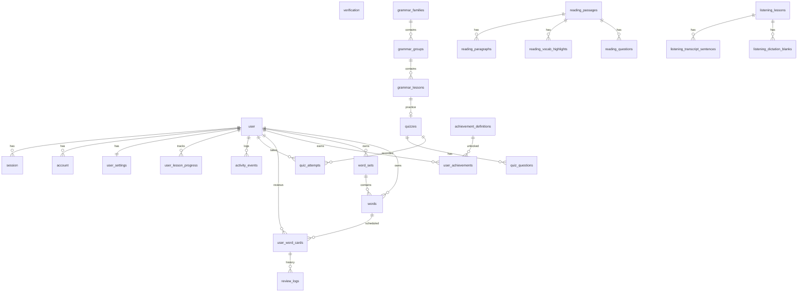

# Phase 0 Report — Audit and schema design

**Status:** complete  
**Date:** 2026-09-30  
**Repo:** chill-english · brand **Easy English**  
**Scope:** design only — no code, packages, or migrations

---

## 1. What was done

Audited `src/types/`, `src/lib/data/`, `src/lib/mock/`, `src/lib/schemas/`, and every caller of the data layer. Designed the PostgreSQL schema, function migration map, public DTO changes, product rules (for confirmation), seed plan, and dependency list below.

### Audit snapshot

| Area | Files | Notes |
|---|---|---|
| Types | 9 under `src/types/` | UI contract shapes; keep as-is for components |
| Data contract | 8 under `src/lib/data/` | Matches `ui-plan/phase-4-report.md` §5 |
| Mocks | 7 under `src/lib/mock/` | ~30 grammar lessons (catalog counts claim 474), 7 reading, 7 listening, 2 quizzes, 9 word sets + 3 words |
| Schemas | `src/lib/schemas/new-word.ts` | Only Zod schema today |
| Client → data | 6 components | Must become Server Actions when DB-backed (see §2) |

**Client components that import the data layer directly**

| Component | Import |
|---|---|
| `dictation-exercise.tsx` | `checkDictation` |
| `add-word-form.tsx` | `createWord` |
| `comprehension-quiz.tsx` | `checkReadingAnswers` |
| `vocab-popover.tsx` | `createWord` |
| `profile-settings.tsx` | `updateSettings` |
| `quiz-view.tsx` | `submitQuiz` |
| `quiz-start.tsx` / `quiz-questions.tsx` | `formatQuizDuration` / `formatTimer` (pure helpers → move to `src/lib/format.ts`) |

---

### 1.1 ERD (Mermaid)



### 1.2 Table list

Conventions: primary keys `text` (cuid/nanoid from Better Auth / app); timestamps `timestamptz`; CEFR as `text` check (`A1`…`C1`); slugs unique per content domain. Snake_case columns in Postgres; Drizzle maps to camelCase in TS.

#### Auth (Better Auth core — generate via `pnpm dlx auth@latest generate`, then extend)

| Table | Columns | Keys / indexes |
|---|---|---|
| `user` | `id` PK, `name` text not null (display name), `email` text not null unique, `email_verified` bool not null, `image` text, `created_at`, `updated_at` | + **app fields** via `additionalFields`: `cefr_level` text not null default `A1`, `timezone` text not null default `Asia/Ho_Chi_Minh`, `goal_text` text null (e.g. `IELTS 6.5`) |
| `session` | `id` PK, `expires_at`, `token` unique, `created_at`, `updated_at`, `ip_address`, `user_agent`, `user_id` FK → user CASCADE | idx `session_user_id` |
| `account` | `id` PK, `account_id`, `provider_id`, `user_id` FK CASCADE, OAuth tokens, `password` (credential), timestamps | idx `account_user_id`; unique (`provider_id`, `account_id`) |
| `verification` | `id` PK, `identifier`, `value`, `expires_at`, timestamps | idx `verification_identifier` |

`member_since` is not a column — mappers format `user.created_at` into `memberSinceLabel`. Initials derived from `name`.

#### Settings

| Table | Columns | Keys / indexes |
|---|---|---|
| `user_settings` | `user_id` PK FK → user CASCADE; `words_per_day` smallint (10\|20\|30\|50); `grammar_per_day` smallint (1\|2\|3); `daily_reminder` bool; `reminder_time` text `HH:MM`; `reminder_days` text[] (`mon`…`sun`); `streak_rescue` bool; `interface_language` text (`en`\|`vi`); `show_vietnamese_hints` bool; `auto_play_pronunciation` bool; `theme` text (`default`\|`blossom`); `updated_at` | 1:1 with user; created on signup |

#### Grammar

| Table | Columns | Keys / indexes |
|---|---|---|
| `grammar_families` | `id` PK (slug), `title`, `sort_order` int | |
| `grammar_groups` | `id` PK (slug), `family_id` FK, `title`, `sort_order` | idx `family_id` |
| `grammar_lessons` | `id` PK (= slug), `slug` unique, `title`, `level`, `family_id`, `group_id` FK, `sort_order`, `read_minutes`, `intro_en/vi`, `use_when_en/vi`, **`structure` jsonb**, **`examples` jsonb**, **`mistakes` jsonb**, `practice_quiz_slug` text null FK soft → quizzes.slug, `practice_question_count`, `practice_minutes` | idx (`group_id`, `sort_order`); idx `level` |

**JSONB justification (structure / examples / mistakes):** always loaded with the lesson, never filtered or joined independently, shape matches seed JSON 1:1. Child tables would add join cost with no query benefit. Same pattern used for quiz type payloads where noted.

#### Reading

| Table | Columns | Keys / indexes |
|---|---|---|
| `reading_passages` | `id` PK (= slug), `slug` unique, `title`, `topic`, `level`, `minutes`, `word_count`, `new_word_count`, `family_label`, `sort_order` | idx (`topic`, `level`) |
| `reading_paragraphs` | `id` PK, `passage_id` FK CASCADE, `sort_order`, `vi` text, **`segments` jsonb** (`[{type,text\|vocabId}]`) | unique (`passage_id`, `sort_order`) |
| `reading_vocab_highlights` | `id` PK, `passage_id` FK, `word`, `ipa`, `part_of_speech`, `meaning_vi`, `level` | idx `passage_id` |
| `reading_questions` | `id` PK, `passage_id` FK, `sort_order`, `prompt`, `choices` jsonb (string[]), **`correct_index` int** (server-only) | unique (`passage_id`, `sort_order`) |

#### Listening

| Table | Columns | Keys / indexes |
|---|---|---|
| `listening_lessons` | `id` PK (= slug), `slug` unique, `title`, `topic`, `level`, `duration_seconds`, `audio_path` text (storage key), `speakers` int, `accent`, `family_label`, `sort_order` | idx (`topic`, `level`) |
| `listening_transcript_sentences` | `id` PK, `lesson_id` FK, `sort_order`, `speaker`, `text`, `start_ms` int, `end_ms` int | unique (`lesson_id`, `sort_order`) |
| `listening_dictation_blanks` | `id` PK, `lesson_id` FK, `sort_order`, `prompt_before`, `prompt_after`, **`answer` text**, **`accept` jsonb** (string[]\|null) | unique (`lesson_id`, `sort_order`) |

#### Quiz

| Table | Columns | Keys / indexes |
|---|---|---|
| `quizzes` | `id` PK (= slug), `slug` unique, `title`, `kick_en/vi`, `breadcrumb`, `level`, `description_en/vi`, `time_limit_seconds`, `pass_score`, `question_types` jsonb (`[{id,label}]`), `lesson_href`, `next_href`, `next_label`, `encouragement_en/vi` | |
| `quiz_questions` | `id` PK, `quiz_id` FK, `sort_order`, `type` text (`multiple_choice`\|`fill_blank`\|`correct_sentence`), shared text fields (`instruction_vi`, `prompt_vi`, `hint_en`, `explanation_en/vi`, `review_before/after`), **`payload` jsonb** (type-specific: options, stemBefore/After, correctIndex / correctAnswers / displayAnswer / wordBank / verbHint / promptEn) | unique (`quiz_id`, `sort_order`); idx `type` |
| `quiz_attempts` | `id` PK, `user_id` FK, `quiz_id` FK, `score`, `total`, `passed`, `time_used_seconds`, `accuracy`, **`answers` jsonb** (display map), **`raw_answers` jsonb** (typed map), `is_full_run` bool, `completed_at` | idx (`user_id`, `quiz_id`, `completed_at` desc); partial unique optional later for “latest full run” via query |

#### Vocabulary

| Table | Columns | Keys / indexes |
|---|---|---|
| `word_sets` | `id` PK (slug), `title`, `title_vi`, `topic`, `level`, **`owner_id` text null** FK → user (null = system catalog), `created_at` | idx `owner_id`; idx (`topic`, `level`); unique (`owner_id`, `id`) not needed if ids globally unique |
| `words` | `id` PK, `word_set_id` FK, `owner_id` text null FK (denormalized for ownership checks; null = system), `word`, `ipa`, `part_of_speech`, `level`, `meaning_vi`, `definition_en`, `examples` jsonb, `collocations` jsonb null, `notes` text null, `image_path` text null, `created_at` | idx `word_set_id`; idx (`owner_id`, `created_at`) |
| `user_word_cards` | `id` PK, `user_id` FK, `word_id` FK, FSRS: `due`, `stability`, `difficulty`, `elapsed_days`, `scheduled_days`, `reps`, `lapses`, `state` smallint, `last_review` timestamptz null | unique (`user_id`, `word_id`); idx (`user_id`, `due`) |
| `review_logs` | `id` PK, `user_id` FK, `card_id` FK, `rating` smallint, `scheduled_days`, `elapsed_days`, `review` timestamptz, `state` | idx (`user_id`, `review`) |

`learned_count` / set `status` are **computed** in mappers (cards with `state` ≥ Review / or reps > 0), not stored on `word_sets`.

#### Progress & activity

| Table | Columns | Keys / indexes |
|---|---|---|
| `user_lesson_progress` | `id` PK, `user_id` FK, `content_kind` text (`grammar`\|`reading`\|`listening`\|`vocabulary_set`), `content_id` text (slug/id), `status` text (`not_started`\|`in_progress`\|`completed`), `progress_percent` int 0–100, `last_position` jsonb null (e.g. `{section:"examples"}` / `{blankIndex:2}`), `updated_at` | unique (`user_id`, `content_kind`, `content_id`); idx (`user_id`, `updated_at` desc) |
| `activity_events` | `id` PK, `user_id` FK, `occurred_at` timestamptz, `local_date` date (computed in user TZ at write), `kind` text (`study_session`\|`word_added`\|`grammar_done`\|`reading_done`\|`listening_done`\|`quiz_done`\|`review_done`), `duration_seconds` int default 0, `payload` jsonb null | idx (`user_id`, `local_date`); idx (`user_id`, `occurred_at`) |

Streak / heatmap / study hours aggregate from `activity_events` (and optionally rollup cache later — out of scope for v1).

#### Achievements

| Table | Columns | Keys / indexes |
|---|---|---|
| `achievement_definitions` | `id` PK (`first-page`, `streak-7`, …), `title`, `subtitle_template`, `icon`, `shape`, `color`, `sort_order`, **`rule` jsonb** (see §1.4) | |
| `user_achievements` | `user_id` FK, `achievement_id` FK, `earned_at` timestamptz, `progress` jsonb null | PK (`user_id`, `achievement_id`) |

---

### 1.3 Function map

Legend: **Auth** = `public` (no session) · `session` (optional; personalize if present) · `required` (must be signed in). **SA** = expose as Server Action for client callers (also callable from RSC via data layer).

| Function | Tables | Query outline | Auth | SA |
|---|---|---|---|---|
| **catalog** | | | | |
| `getFirstGrammarLessonSlug` | `grammar_lessons` | `order by family/group/sort limit 1` | public | no |
| `getFirstReadingSlug` | `reading_passages` | min `sort_order` | public | no |
| `getFirstListeningSlug` | `listening_lessons` | min `sort_order` | public | no |
| `getSampleQuizSlug` | — / `quizzes` | constant or first quiz | public | no |
| **home** | | | | |
| `getDailyGoal` | `user_settings`, `activity_events`, streak derive | today’s counts in user TZ vs settings targets | required | no |
| `getWordOfTheDay` | `words` (system) | deterministic pick by `local_date` hash | session | no |
| `getContinueItems` | `user_lesson_progress` + content tables | top N `in_progress` by `updated_at`, filter level | required | no |
| `getSectionEntries` | counts from grammar/vocab tables | aggregate catalog stats for subtitles | public | no |
| `getHomeCatalogStats` | grammar + word tables | `count(*)` | public | no |
| `getGreeting` | `user` | session display name + hour buckets | session | no |
| **grammar** | | | | |
| `getLesson` | `grammar_lessons` + family/group | by slug | public | no |
| `getAdjacentLessons` | `grammar_lessons` | prev/next in global sort | public | no |
| `getGrammarTree` | families/groups/lessons + `user_lesson_progress` | filter tree; progress for active family | session | no |
| **vocabulary** | | | | |
| `getWordSets` | `word_sets` + card aggregates | system ∪ user’s sets; filters | required* | no |
| `getTopicCounts` | `word_sets` | group by topic (catalog-facing) | session | no |
| `getWord` / `getWordsInSet` | `words` | by id / set; ownership | required* | no |
| `getReviewDueCount` / `getReviewDue` | `user_word_cards` + `words` | `due <= now` order by due | required | no |
| `getSavedWordCount` | `words` / cards | count user-accessible saved words | required | no |
| `getAddedToday` | `words` | `created_at` in local today + `owner_id` | required | no |
| `createWord` | `words`, optional `word_sets`, `user_word_cards`, `activity_events` | insert + init FSRS card | required | **yes** |
| **reading** | | | | |
| `getPassages` | passages + progress | list + `completed`/`inProgress` flags | session | no |
| `getPassage` | passage + children **without** `correct_index` | hydrate DTO | session | no |
| `getReadingProgress` | progress + passages | done/total | session | no |
| `checkReadingAnswers` | `reading_questions` | score server-side; return correctIndex in **result** only | required | **yes** |
| **listening** | | | | |
| `getListeningLessons` | lessons + progress | list flags | session | no |
| `getListeningLesson` | lesson + transcript + blanks **without** answer/accept | public audio URL via storage | session | no |
| `checkDictation` | blanks | normalize compare; return answers in **result** | required | **yes** |
| **quiz** | | | | |
| `getQuiz` | quizzes + questions **strip keys** | map payload → UI question minus answers | session | no |
| `getLastAttempt` | `quiz_attempts` | latest full run for user+slug | required | no |
| `submitQuiz` | questions + attempts + activity | score; write attempt; build review (includes correct) | required | **yes** |
| `formatQuizDuration` / `formatTimer` | — | move to `src/lib/format.ts` | n/a | n/a |
| **profile** | | | | |
| `getProfile` | user, settings, progress aggregates | map labels | required | no |
| `getActivity` | `activity_events` | bucket by local_date → intensity | required | no |
| `getAchievements` | definitions + `user_achievements` | merge earned/progress | required | no |
| `updateSettings` | `user_settings` | patch Zod-validated | required | **yes** |

\*Vocabulary catalog reads may allow anonymous browsing of **system** sets later; v1 assumes required session once auth lands (Phase 3+).

**Also needed later (not in today’s contract — list only):** `recordStudySession`, mark lesson progress, FSRS `reviewCard`, achievement evaluator — wired inside mutations above or thin actions in Phases 5–7.

---

### 1.4 Public DTO changes (answer keys)

| Type / path | Remove from client payloads | How UI still works |
|---|---|---|
| `ComprehensionQuestion.correctIndex` | omit on `getPassage` | `checkReadingAnswers` Server Action returns `correctIndex` + `isCorrect` per question after submit (same `CheckReadingAnswersResult`) |
| `DictationBlank.answer` / `accept` | omit on `getListeningLesson` | `checkDictation` returns `answer` + `isCorrect` in result only |
| `MultipleChoiceQuestion.correctIndex` | omit on `getQuiz` | `submitQuiz` review includes `correct` display string |
| `FillBlankQuestion.correctAnswers` | omit on `getQuiz` | keep `displayAnswer` **only in review** after submit; during quiz show stem + wordBank without revealing |
| `CorrectSentenceQuestion.correctIndex` | omit on `getQuiz` | same as MC via `submitQuiz` review |
| `QuizResult` / review | unchanged (post-submit, authenticated) | already the secure channel for answers |

`displayAnswer` must **not** ship in the public quiz DTO either (it reveals the blank). Include it only in `QuizReviewItem.correct` after `submitQuiz`.

Types in `src/types/` may split into `Public*` vs full server types, or keep optional fields undocumented for clients — prefer explicit public types in Phase 4–5 reports when implementing.

---

### 1.5 Rules to confirm (proposed defaults)

| Rule | Proposal |
|---|---|
| **Streak** | A day counts if ≥1 qualifying activity in the user’s timezone (`word_added`, `grammar_done`, `reading_done`, `listening_done`, `quiz_done` full pass or any attempt?, `review_done`, or `study_session` with `duration_seconds ≥ 60`). Current streak = consecutive local dates ending today (or yesterday if today empty and `streak_rescue` allows one gap — confirm). Best streak = max historical run. |
| **Daily goal (words)** | Count `word_added` events (and/or new `user_word_cards`) on local date vs `user_settings.words_per_day`. |
| **Daily goal (grammar)** | Count `grammar_done` (lesson marked completed) vs `grammar_per_day`. |
| **Study minutes** | Prefer explicit `study_session` events (timer / pomodoro). Also add estimated minutes on content completion (grammar `read_minutes`, reading `minutes`, listening `duration_seconds`, quiz `time_used_seconds`) so heatmap isn’t empty without a timer. Intensity bands: 0 / 1–14 / 15–29 / 30–44 / 45+ minutes → 0–4. |
| **Continue where left off** | Up to 3 `user_lesson_progress` rows with `status=in_progress`, order by `updated_at` desc; kinds grammar + vocabulary_set (match current UI). Optionally add reading/listening later (UI `ContinueKind` would need extending — out of scope unless you ask). |
| **Word of the day** | Among system words with ≥1 example: `hash(userId + localDate) % n` (or global pool if logged out). Stable for the calendar day in user TZ. |
| **Achievements** | Seed the 8 mock ids: `first-page` (any grammar completed), `streak-7` / `streak-30`, `word-collector` (≥1000 saved words), `grammar-geek` (≥50 grammar completed), `early-bird` (activity before 07:00 local), `night-owl` (after 23:00), `b2-unlocked` (B1 level progress ≥100% or `cefr_level ≥ B2`). Evaluate on relevant writes. |
| **Level progress %** | Per CEFR band: weighted completion of grammar lessons + reading + listening at that level (equal weight v1). `current` = user’s `cefr_level`; higher bands `locked` until previous ≥ 80% (confirm threshold). |

---

### 1.6 Seed plan

| Mock source | Seed JSON | Notes |
|---|---|---|
| `mock/grammar.ts` tree + featured body | `content/grammar/families.json`, `groups.json`, `lessons/*.json` (or one `lessons.json`) | Stable ids = existing slugs (`sentence-foundations`, `use-subject-verb-clauses`, …). Expand bodies for non-featured lessons from template or short stubs. |
| `mock/reading.ts` | `content/reading/passages.json` | Full body for `the-night-bus-to-da-lat`; stubs keep structure. Questions include `correctIndex` in seed (DB only). |
| `mock/listening.ts` | `content/listening/lessons.json` + audio files under `content/audio/` → storage volume | `audioSrc` → storage key e.g. `listening/checking-in-at-the-airport.mp3` (placeholder file ok). |
| `mock/quiz.ts` | `content/quiz/*.json` | Both quizzes; answers in seed → DB columns only. |
| `mock/vocabulary.ts` | `content/vocabulary/sets.json`, `words.json` | System sets (`owner_id` null). Topic count totals in mock (86) are **marketing numbers** — seed only the 9 real sets unless we fabricate more. |
| Achievements | `content/achievements.json` | 8 definitions + rules. |
| Demo user | created by seed script, not JSON | Email `linh@example.com`, password from env `SEED_DEMO_PASSWORD`, name `Linh Trần`, level `B1`, timezone `Asia/Ho_Chi_Minh`, goal `IELTS 6.5`, settings = `seedSettings`, sample progress/attempts/cards/activity so Home/Profile aren’t empty. |

Seeder is **idempotent**: upsert by primary slug/id; do not duplicate demo user (lookup by email).

**Catalog honesty:** `getHomeCatalogStats` / section subtitles should reflect DB counts (e.g. ~30 lessons), not the mock’s 474/2140 — unless you want filler seed data (confirm).

---

### 1.7 Dependencies to add (versions as of 2026-09-30 npm `latest`)

| Package | Version | Role |
|---|---|---|
| `drizzle-orm` | 0.45.3 | ORM |
| `drizzle-kit` | 0.31.11 | migrations (dev) |
| `pg` | 8.23.0 | driver |
| `@types/pg` | 8.23.1 | types (dev) |
| `better-auth` | 1.7.6 | auth |
| `ts-fsrs` | 5.4.2 | spaced repetition |
| `server-only` | 0.0.1 | boundary |
| `nodemailer` | 10.0.12 | SMTP mailer |
| `@types/nodemailer` | 8.0.2 | types (dev) |

Pin exact versions at install time in Phase 1. Optional later: `vitest`, Playwright already present.

Docker (Phase 1/2): `postgres:16-alpine` service + volume; `DATABASE_URL`; files volume for storage.

---

### 1.8 Risks and open questions

1. **Mock vs real catalog size** — UI copy assumes hundreds of lessons; seed has dozens. Confirm: compute real counts vs generate filler content.
2. **Better Auth schema drift** — always regenerate with CLI; app `additionalFields` must stay in sync.
3. **Client data imports** — must be migrated before `src/lib/data` becomes `server-only` or the client bundle breaks.
4. **`ContinueKind`** — only grammar/vocabulary; reading/listening `inProgress` exists but has no Continue card type.
5. **Reminders** — settings UI only; no push/email scheduler in scope until a later phase (mailer interface still lands in infra).
6. **Edit profile** — still disabled in UI; needs a contract addition (`updateProfile`) when you want it.
7. **Quiz `displayAnswer` / explanations** — explanations on questions are fine publicly; answers are not. Double-check fill-blank UX without `displayAnswer` pre-submit.
8. **Ownership model** — user-created words in a system set: propose forbidding (`owner_id` required on user words; user words only in user-owned sets) OR allow personal copies. Confirm.
9. **Streak rescue / qualifying events** — product rules in §1.5 need your OK before Phase 7 implements them.

---

## 2. Contract changes

None implemented (no code). **Planned** (must be listed again when coded):

| Change | Phase (approx.) |
|---|---|
| Strip answer keys from `getPassage` / `getListeningLesson` / `getQuiz` | 4–5 |
| Mutations → Server Actions (`createWord`, `check*`, `submitQuiz`, `updateSettings`) | 3–6 |
| Move `formatTimer` / `formatQuizDuration` → `src/lib/format.ts` | 1 or 5 |
| `getGreeting` / headlines use session name, not `MOCK_USER_NAME` | 3+ |
| Optional: `updateProfile`, `recordStudySession`, FSRS review action | 6–7 |

---

## 3. How to run / test what was built

Design-only phase. Verification run on the unchanged app:

```bash
pnpm lint
pnpm typecheck
pnpm build
```

(No `pnpm test` script yet; Docker unchanged.)

---

## 4. Decisions I should confirm

1. Accept schema + JSONB choices in §1.2?
2. Accept product rules in §1.5 (streak, goals, study minutes, WOTD, achievements, level %)?
3. Seed **real** mock volumes (honest stats) vs pad to mock marketing numbers?
4. User words: only in user-owned sets, or allowed inside system sets?
5. Extend Continue to reading/listening in a later UI tweak, or keep grammar+vocab only?
6. Qualifying streak events: does any quiz attempt count, or only passed full runs?

---

## 5. Plan for the next phase

**Phase 1 — Infrastructure and server boundary** (`be-plan/02-phase-1-infra-boundary.md`):

- Add deps from §1.7; `src/env.ts`; Postgres in `docker-compose.yml`; Drizzle client + empty schema folder; `server-only` boundaries; storage + mail interfaces (local/console drivers); move format helpers; `.env.example`.
- Do **not** implement full schema/seed (Phase 2) or auth UI (Phase 3).

**STOP** — await approval before Phase 1.
