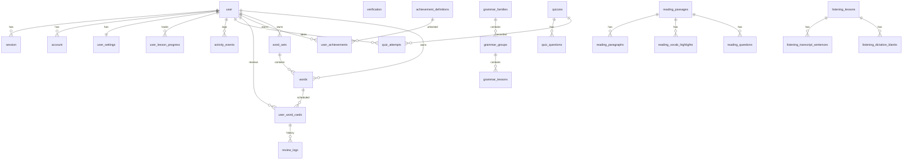

# Phase 2 Report — Schema, migrations and seeders

**Status:** complete  
**Date:** 2026-09-30  
**Repo:** chill-english · brand **Easy English**

---

## 1. What was done

### Drizzle schema (one file per domain)
| File | Tables |
|---|---|
| `src/db/schema/auth.ts` | `user` (+ `cefr_level`, `timezone`, `goal_text`), `session`, `account`, `verification` |
| `src/db/schema/settings.ts` | `user_settings` |
| `src/db/schema/grammar.ts` | `grammar_families`, `grammar_groups`, `grammar_lessons` |
| `src/db/schema/reading.ts` | `reading_passages`, `reading_paragraphs`, `reading_vocab_highlights`, `reading_questions` |
| `src/db/schema/listening.ts` | `listening_lessons`, `listening_transcript_sentences`, `listening_dictation_blanks` |
| `src/db/schema/quiz.ts` | `quizzes`, `quiz_questions`, `quiz_attempts` |
| `src/db/schema/vocabulary.ts` | `word_sets`, `words`, `user_word_cards`, `review_logs` |
| `src/db/schema/progress.ts` | `user_lesson_progress`, `activity_events` |
| `src/db/schema/achievements.ts` | `achievement_definitions`, `user_achievements` |
| `src/db/schema/common.ts` | CEFR check helper, shared timestamps |
| `src/db/schema/index.ts` | barrel re-export |

Constraints: unique slugs, CEFR / enum CHECKs, FKs with CASCADE, composite uniques on child sort orders. `grammar_lessons.practice_quiz_slug` is a soft ref (no hard FK).

### Migrations
| File | Purpose |
|---|---|
| `drizzle/0000_baseline.sql` | Phase 1 no-op (kept) |
| `drizzle/0001_blue_inertia.sql` | Full domain DDL (26 tables) |

### Content JSON + Zod
| Path | Source |
|---|---|
| `content/grammar.json` | 7 families · 13 groups · 30 lessons |
| `content/reading.json` | 7 passages (+ paragraphs / vocab / questions) |
| `content/listening.json` | 7 lessons (+ transcript / blanks) |
| `content/quiz.json` | 2 quizzes · 20 questions |
| `content/vocabulary.json` | 9 system sets · 3 words |
| `content/achievements.json` | 8 definitions + rule JSON |
| `content/audio/listening/*.wav` | seed audio |
| `content/schema.ts` | Zod validators for every file |
| `scripts/dump-content-from-mocks.ts` | regenerate JSON from mocks (`pnpm db:dump-content`) |

### Seeder
`scripts/seed.ts`:
- Validates all JSON **before** any writes; points at the bad path on failure
- Idempotent upserts by stable id/slug, transaction per domain
- Default / `--content`: content only
- `--demo`: also creates Linh (`SEED_DEMO_EMAIL` / `SEED_DEMO_PASSWORD`) with settings, progress, quiz attempt, word cards, activity, achievements
- Copies audio into `STORAGE_DIR`

### Mappers + tests
`src/lib/data/mappers/` — `grammar`, `reading`, `listening`, `quiz`, `vocabulary`, `profile`  
Unit tests + `src/db/__tests__/seed-parity.test.ts` (counts + sample records + second-run idempotency).

### ERD (as built)



---

## 2. Contract changes

None for the UI data layer — still mock-backed. Mappers exist for Phase 4+ wiring.

Env additions (optional defaults): `SEED_DEMO_EMAIL`, `SEED_DEMO_PASSWORD`.

---

## 3. How to run / test what was built

```bash
docker compose up -d db
pnpm db:reset                 # drop/recreate + migrate
pnpm db:seed -- --demo        # content + Linh
# re-run is safe:
pnpm db:seed -- --demo

pnpm lint && pnpm typecheck && pnpm test && pnpm build
```

### Verification (2026-09-30)
- `pnpm lint` — pass
- `pnpm typecheck` — pass
- `pnpm test` — pass (14 tests: mappers + seed parity + smoke)
- `pnpm build` — pass
- Seed twice — counts unchanged

---

## 4. Decisions I should confirm

1. Catalog honesty: seeded grammar = **30** lessons (not mock marketing 474). OK for Phase 4 `getHomeCatalogStats`?
2. Vocabulary: **9** sets / **3** real words (set `wordCount` in UI will be computed from rows, not mock padding). Fabricate more words later?
3. Better Auth tables were hand-written to match docs — regenerate with `pnpm dlx auth@latest generate` in Phase 3 and reconcile?
4. Demo password default `password123` — change before any shared deploy?

---

## 5. Plan for the next phase

**Phase 3 — Authentication** (`be-plan/04-phase-3-auth.md`):

- Wire Better Auth (email/password + Google), session helpers, auth pages
- Create `user_settings` on signup; keep data layer on mocks until Phase 4

**STOP** — await approval before Phase 3.
